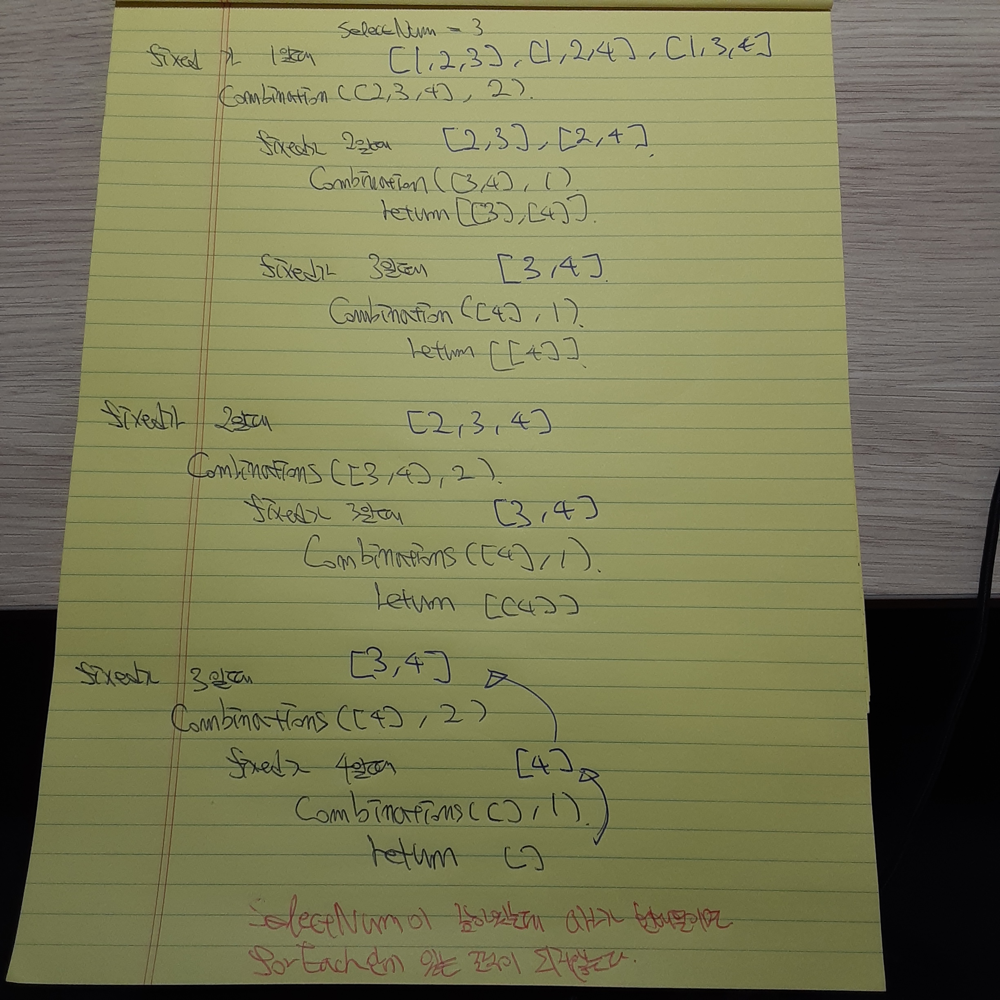

<h1>조합</h1>

순열과 다르게 순서가 달라도 요소가 겹친다면 같은 값으로 보지않는다. 해서 [1,2,3,4]를 3개씩 조합하면
다음과 같다

==>> [1,2,3], [1,2,4], [1,3,4], [2,3,4]

<h3>nCr = n! / (r! * (n - r)!)</h3>
C is Combination, n is total elements count, r is what we want to get how much
combination in total elements count.

```js
  function getCombination(arr, r){
    let result = [];

    if(r === 1){
      return arr.map((el) => [el]);
    }

    arr.forEach((fixed, idx, origin) => {
      const rest = origin.slice(idx + 1);
      const combination = getCombination(rest, r - 1);
      const attached = combination.map((el) => [fixed, ...el]);
      result.push(...attached);
    })
    return result;
  }
```

<h2>위 코드 풀이</h2>
getCombination([1,2,3,4], 3)라면?


