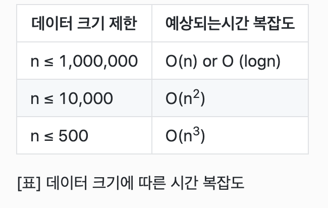
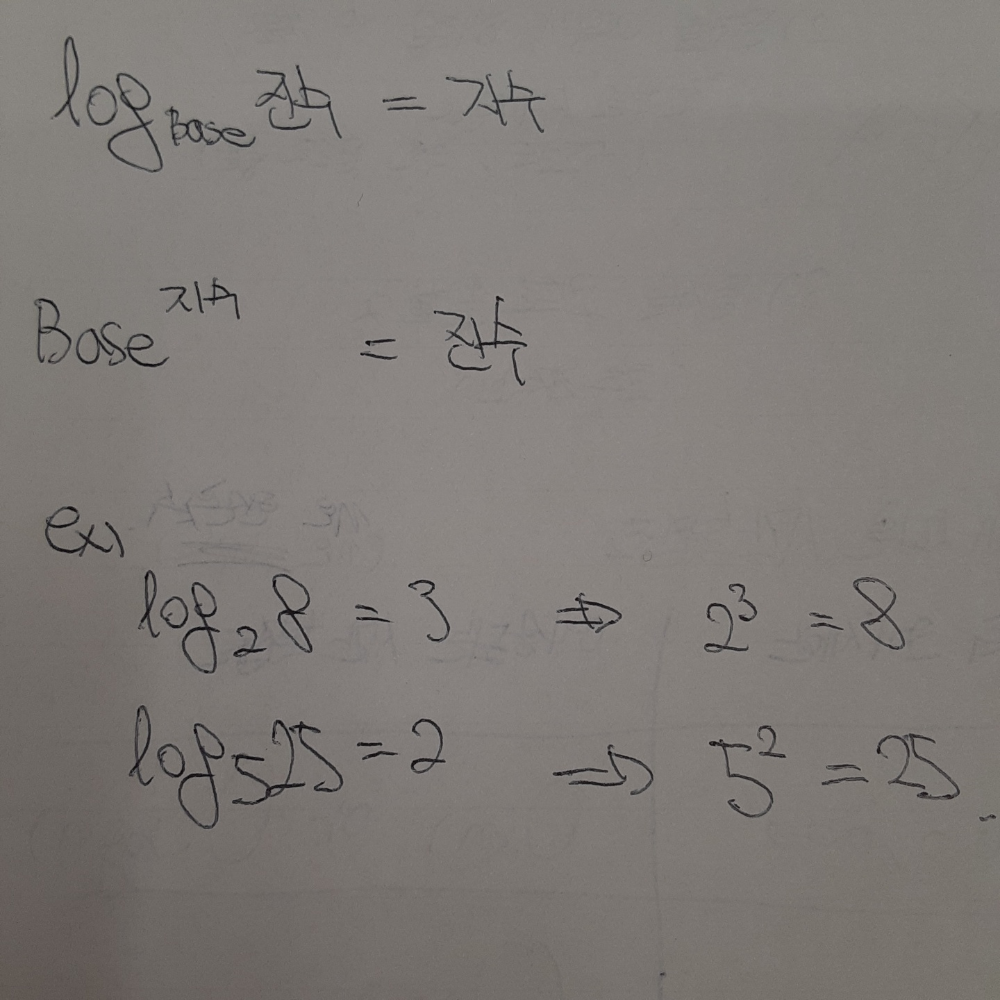

<h1>알고리즘 문제를 푼다는 것은 내가 생각한 문제해결 과정을 컴퓨팅 사고로 변환하여
코드로 구현한다는 것</h1>

<br>

<h1>알고리즘 풀이 단계/h1>
1) 문제 이해 (input, output에 대한 이해)
2) 문제를 어떻게 해결할 수 있을지, 전략을 세워야함 (코드작성전 무조건 수도코드)
3) 문제를 코드로 옮겨볼 것 (코드 최적화)

<h1>데이터 크기에 따른 시간 복잡도</h1>
n은 인풋사이즈, 이 표를 기준으로 문제에서 예상되는 시간복잡도를 예측할
</img>

<h1>Big O</h1>
시간복잡도를 빅오표기법으로 나타내는 것으로, 입력값의 변화에 따라 연산을 실행할때, 연산횟수에 비해 시간
이 얼만큼 걸라는 가를 표기하는 것.

빅오표기법에선 상수를 표기하지 않음 (log에서 지수제외)

<h3>O(1)</h3>
인풋사이즈에 상관없이 한번의 연산으로 결과값이 나옴
<h3>O(n)</h3>
인풋사이즈에 따라 연산횟수가 비례함
ex) 선형그래프, for문으로 배열 순회등
<h3>O(logn)</h3>
대표적으로 binary search(이진검색)이 있는 데, 이진검색은 input size가 20이면 반으로 나누고
또 나눠서 검색을 한다. 이와 같이 로그도 제곱한 것을 그대로 제곱한 base값으로 나누기 때문에
이진검색은 O(logN)이라고 표기할 수 있겠다.
```js
for(let i = 0; i < n; i++){
  i *= 4;
}
O(logkN)
O(logN)
```
<h3>O(n^2)</h3>
ex) 이중 for문




<h1>Greedy Algorithm</h1>
매순간 최선의 값으로 결과를 도출하는 알고리짐, 뒤의 연산을 할 시 더 좋은 결과가 나옴을 고려하지 않아
탐욕스럽다하여, 이름이 탐욕알고리즘이다.

또한 최적에 근사한 값에 빠르게 도출할 수 있다하여 근사알고리즘으로도 불린다
