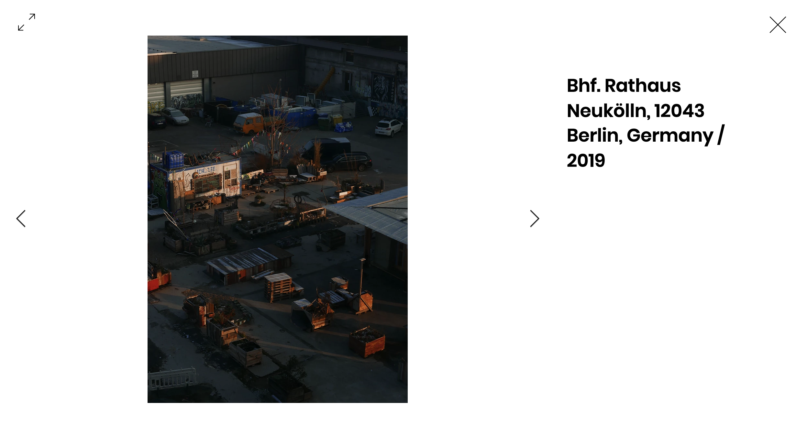
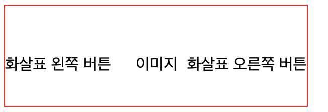
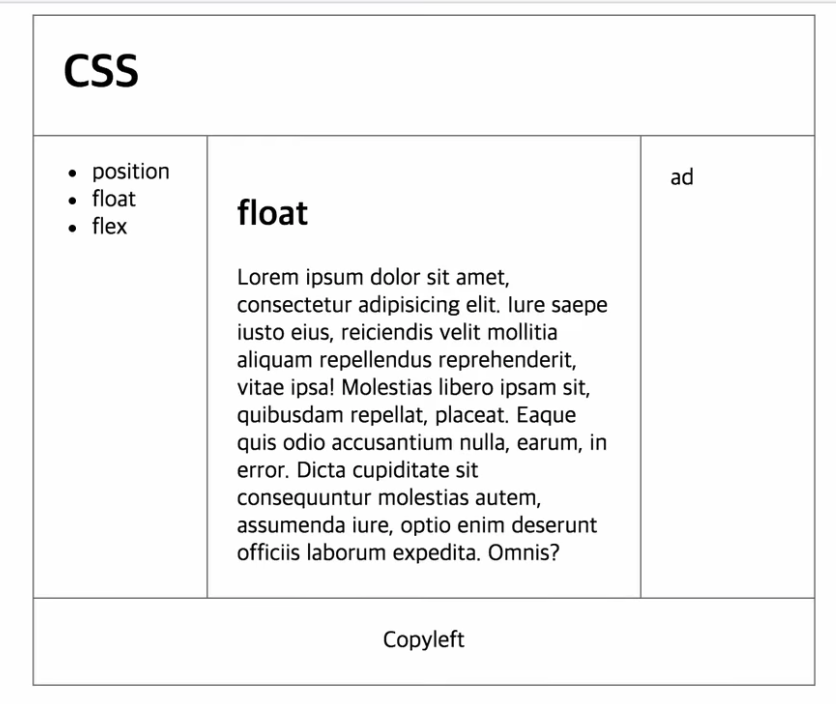

stylish는 웹사이트의 디자인을 사용자 마음대로 수정할 수 있는 기능

[https://userstyles.org/](https://userstyles.org/)

많이 쓰이는 css 속성을 나열함을 볼 수 있는 추천검색어

⇒ Global CSS Property Usage

Cascading ⇒ 폭포란 뜻

1순위 id, 2순위 class(리액트에선 className), 3순위  엘레멘트(Tag)

```css
li{color:red;}
#idsel{color:blue;}
#idsel{color:yellow;}
.classsel{color:green;}

h1, a{
	// 이렇게도 동시에 선택자 사용 가능
}

1순위 : #idsel{color:yellow;}
2순위 : #idsel{color:blue;}
3순위 : .classsel{color:green;}
4순위 : li{color:red;}
```

# 레이아웃(Layout)

## 인라인 VS 블럭레벨

a태그처럼 자신과 자신을 둘러싸고있는 텍스트와 함께 나열되는 즉, 줄바꿈이 되지 않는 태그를 **인라인엘리먼트.**

인라인엘리먼트가 좋을 수도 있고, 블럭레벨엘리먼트가 좋을 수도 있다. 상황에 따라 쓰임이 다르다.

```css
h1{display:inline;}
a{display:block;}

/* 이렇듯 얼마든지 바꿔줄 수 있음*/
```

## 박스모델(Box Model)

⇒ 엘리먼트와 엘리먼트 사이의 간격을 결정함

박스모델은 각각이 태그들이 웹페이지에 표현될때 부피감을 표현함

여백, 위치 크기, etc...

<p>는 파라그래프(단락)의 약자

```css
p {
border: width styled color;
padding: px;
margin: px;
}
```

## 마진겹침 현상(margin-collapsing)

### 부모자식간의 마진겹침 현상

부모태그가 아무런 시각적으로 효과가 없는 태그인데 마진이 있는 경우 자식태그와 마진겹침 현상이 난다.

```css
#parent {
	/* border: 1px solid tomato; */
	margin-top: 100px;
}
#child{
	background-color: powderblue;
	margin-top: 50px;
}
```

만약 #child의 margin-top이 100이 넘어가는 순간 마진겹침을 넘어서 그제야 움직이게 될 것이다.

마진겹침 현상 : 부모엘리먼트의 마진이 자식엘리먼트의 마진으로 사용되어지는 것

### 마진겹침현상2

마진값을 가지고있는 태그의 시각적인 요소가 없는 경우 마진값이 가장 높은 마진값이 그 태그의 마진값이 된다.

```html
<!doctype html>
<html>
<head>
    <style>
        #empty{
            margin-top:50px;
            margin-bottom: 100px;
/*            border:1px solid tomato;*/
        }
        #normal{
            background-color: powderblue;
            margin-top:100px;
        }
    </style>
</head>
<body>
    <div id="empty"></div>
    <div id="normal">normal</div>
</body>
</html>
/* From 생활코딩 */
```

## 포지션(postion) (중요) 🔥

⇒ 각각의 엘리먼트들의 위치를 결정함

엘리먼트의 위치를 지정하는 4가지 방법이 있다.

- static
- relative
- absolute
- fixed

### static(정적인) VS relative(상대적인)

relative는 **부모태그에** 대해서 상대적으로 위치를 지정할 수 있다.

static과 relative의 차이점은 offset을 사용해서 위치시킬 수 있느냐 없느냐하는 것이다.

```css
div {
	/* css의 position속성의 기본값 => static, 정적이란 뜻임
		 다른 말로 위치와 관련된 설정을 하지 않은 상태
	*/
	position:
	/* offset */
	left:  
	top:

	/*
		(left와 right, top과 bottom이 같이 있을 경우)
		left와 right중 left가 먼저
		top과 bottom중 top이 먼저
		position이란 속성을 주지않으면 offset이 안 먹을 것임
	*/
}
```

### absolute (절대 포지션)

absolute일때 width을 100%쓰지 않는다.

absolute 포지셔닝은 부모태그가 positioned 엘리먼트를 필요로한다.

또한 absolute와 relative는 다음과 같은 디자인에서 레이아웃을 나누는데 용이하게 사용할 수 있다.





⇒ 출처 : junsngwon.com

```html
<html>
	<head>
		<style>
      #relative{
  display: flex;
  position: relative;
  width: 300px;
  height: 100px;
  border: 1px solid red;
}

#absolute1{
  position: absolute;
  top: 50px;
}
#absolute2{
  position: absolute;
  top: 50px;
  left: 130px;
}
#absolute3{
  position: absolute;
  top: 50px;
  right: 0px;
}
		</style>
	</head>
	<body>
		<div id="relative">
			<div id="absolute1">
        화살표 왼쪽 버튼
      </div>
			<div id="absolute2">
        이미지
      </div>
			<div id="absolute3">
        화살표 오른쪽 버튼
      </div>
		</div>
	</body>
</html>
```





⇒ [junsngwon.com](http://junsngwon.com) 사이트에서 한 것 처럼 디자인을 레이아웃한 위의 코드 output

### fixed

fixed는 절대적으로 웹페이지에 고정되어 있다. 해서 사용자가 스크롤해서 페이지를 조금 내린다던가 할때 상단바가 안보이는 현상을 고려하여 fixed를 사용할 수 있다.

```html
<!DOCTYPE html>
<html>
<head>
  <style>
    #header{
      border: 1px solid black;
      display: flex;
      width: 100%;
      /* position: absolute; */
      /* left: 10px;
      top: 10px; */
      position: fixed;
    }
    #header div{
      display: flex;
      flex: 1 1 auto;
      justify-content: center;
    }

    #whatthe{
      position: absolute;
      top: 50px;
    }
  </style>
</head>
<body>
  <div id="header">
    <div>메뉴</div>
    <div>제목</div>
    <div>공지사항</div>
  </div>
  <div id="whatthe">
    <h1>내용들</h1>
  </div>
</body>
</html>
```

## float(붕뜨다, 부유하다)

float, clear 는 사용빈도가 높은속성

float는 본문에 이미지를 삽입할때 쓰이는 속성이다.

```html
</img>
<p style="border: 1px solid blue;">lorem ipsum<p>
<p style="
border: 1px solid blue;
clear: both;
/*
	clear 속성값은 both, right, left가 있는데
	float가 right면 clear는 left
	float가 left면 clear는 right
	float에 맞춰 clear를 위치시킨다는 both
*/
">lorem ipsum<p>
```

이미지 삽입의외에도 float는 레이아웃을 잡을때 많이 사용한다.

### holy grail layout

성배(grail)를 찾는 것만큼 레이아웃을 하기 어려워서..라는 레이아웃





출처 : 생활코딩

두가지가 있을듯, flex나 float(with clear)로 레이아웃하는 경우들

# ?

그런건 어떻게 할까 저렇게 레이아웃을 나누면 article부분이 엄청길어도 article부분만 스크롤해서 내용을 볼 수 있도록 할 수 있는..

css 박스모델에서는 테두리를 포함한다. (px)

## box-sizing 생활코딩 볼 것

레이아웃해보자 일단 해보는 게 중요함.

flex로 6개해보자

요즘 flex쓰고 float는 거의 안쓰는 데 알아둬야 코드읽을 수 있으니깐..

개인적으로 포트폴리오 만들때는 flex를 레이아웃할 때 사용하고 float는 이미지와 글 삽입할때 사용해보자
