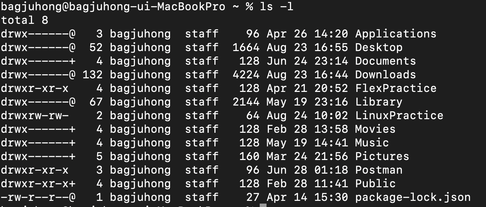
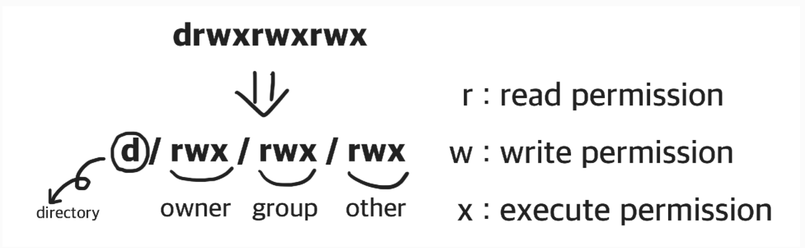

<strong>사용권한이란 무엇인가 ?</strong>
사용할 수 있는 권한을 의미하며 리눅스에선 파일과 폴더에 대한 사용권한이 위의 사진에서 본 것처럼 read, write, excute가 있다. 또한 사용권한을 소유하고 있는 소유자는 사용을 할 수 있다.
  

<h3>ls -l</h3>
터미널에 <strong>ls -l</strong>이라는 명령어를 사용하게 되면 다음과 같은 출력값이 나온다.

 

위의 출력값을 본다면 아래와 같은 출력값이 나오는데 간단히 설명하자면 처음자리의 d는 폴더 -는 파일을 의미한다. 또한 아래 사진과 같이 3자리씩 나눠서 어느자리에 다음과 같은 rwx가 있다면 그 자리에 있는 사용자가 그러한 권한을 가지고 있다는 것을 의미한다.

  
이때 사용권한을 확인 할 수 있는 명령어인 <strong>ls -l</strong>를 알아보았고, 이젠 파일에 적용된 사용 권한을 변경하는 명령어인 <strong>chmod</strong>에 대해 알아보겠다.

<h3>chmod</h3>
chmod를 쓰는 방법은 두가지가 있다.

<strong>Symbolic method</strong>
: chmod <A><B><C> <filename>
A : u(user) 혹은 g(gruop) 혹은 o(other) 혹은 a(all)를 적는 란으로 어디에 rwx를 즉 사용
권한을 추가하고 삭제할 것인지를 적는 란이다.
B: -, +, =(+와 동일) => 빼고 더하는 옵션이다.
C: 어느 사용권한을 추가하고 삭제할 것인지를 묻는 란으로 r(read), w(write), x(excute)
중 하나를 옵션으로 적으면 된다.

<strong>Absolute method</strong>
: 이는 read를 4, write를 2, excute를 1로 bits를 정한다. 그리고 총 세자리가 있는데 이는
u(user), g(gruop), o(other)이다.

사용예제
:
chmod 736 <filename>  
===>>> chmod u+rwk <filename>, chmod g+wx <filename>, chmod o+rw <filename>
        와 동일하다.
